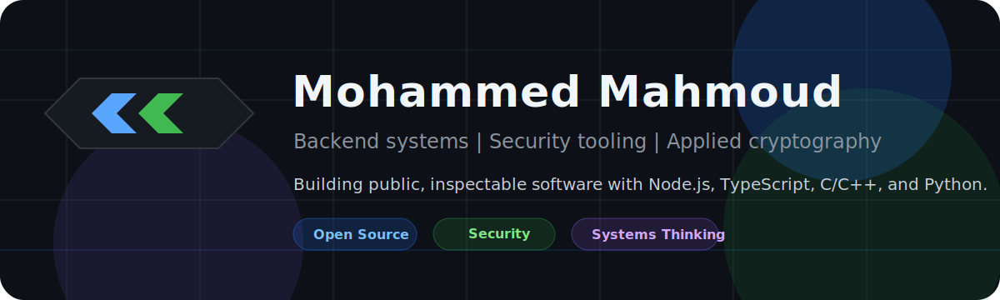

  

### Hi there

I'm Mohammed Mahmoud, a software engineering student in Egypt building public, inspectable work around backend systems, security tooling, and applied cryptography.

This is an evidence-first profile: what I built, what it proves, what is still in progress, and where I am heading next.

[Portfolio](https://rlxchap2.github.io/portfolio/) | [LinkedIn](https://www.linkedin.com/in/mohammed-mahmouds) | [Email](mailto:rlxchap2@outlook.com) | [X](https://x.com/0xR1A7)

---

### Snapshot

| Area | Details |
| --- | --- |
| Current identity | Software engineering student focused on backend systems, security tooling, and applied cryptography |
| Main stack | Node.js, TypeScript, JavaScript, C, C++, Python |
| What I like building | APIs, CLI tools, diagnostics apps, browser-based security utilities, cryptography experiments |
| Open source direction | Tests, documentation, small fixes, issue discussions, and Node.js ecosystem learning |
| Current long-form work | Writing an Arabic technical book / challenge system around cryptography, reverse engineering, and digital forensics |
| Location | Egypt |

---

### What I am focused on

| Focus | What it means in my work |
| --- | --- |
| Backend systems | APIs, service structure, validation, documentation, testing, and maintainable project layouts |
| Security tooling | Defensive utilities, diagnostics, privacy-first browser tools, and malware-analysis workflows |
| Applied cryptography | Educational implementations, experimental cipher design, bit operations, state machines, and clear safety notes |
| Open source | Contributing through small, reviewable changes before claiming bigger ecosystem roles |

---

### Selected work

| Project | Why it matters | Stack |
| --- | --- | --- |
| [MASC-256](https://github.com/RlxChap2/MASC-256) | Experimental stream-cipher design in C. Built to study state evolution, memory-dependent transformations, rotations, XOR operations, and responsible crypto documentation. Not intended for production cryptography. | C, CMake |
| [Bonyan API](https://github.com/BonyanOSS/Bonyan-API) | A structured Fastify API with tests, OpenAPI docs, Docker support, changelog, roadmap, contributing docs, security policy, and source fallback handling. | TypeScript, Node.js, Fastify |
| [IPInspectorZ](https://github.com/RlxChap2/IPInspectorZ) | Desktop network and device diagnostics app designed around no login, no telemetry, and no file scanning. | TypeScript, Tauri, Rust |
| [CyberTools](https://github.com/ctlib/CyberTools) | Client-side cybersecurity utilities with privacy notes, roadmap, security policy, and no backend data collection. | JavaScript, HTML, CSS |
| [Quiz Master](https://github.com/RlxChap2/quiz-master) | Educational platform for organizing quizzes, video lectures, and learning materials. | TypeScript, Node.js, Tailwind CSS |
| [cf-practice-archive](https://github.com/RlxChap2/cf-practice-archive) | Personal archive for algorithm practice and problem-solving consistency. | C++ |

---

### Open source activity

| Project | Contribution | Status |
| --- | --- | --- |
| [Express.js](https://github.com/expressjs/express/pull/7050) | Improving test coverage for `res.set()` edge cases | Pull request open |
| [webpack.js.org](https://github.com/webpack/webpack.js.org/pull/8252) | Arabic documentation contribution | Pull request open |
| [Node.js Translator](https://crowdin.com/project/nodejs-web/activity-stream) | Arabic locales Contribution | Ongoing |

---

### Writing and research

| Work | Status | Scope |
| --- | --- | --- |
| Arabic technical book / challenge system | In progress | Cryptography, reverse engineering, digital forensics, binary analysis, steganography, and puzzle-based problem solving |
| Project documentation | Ongoing | READMEs, roadmaps, security notes, contribution guides, and architecture notes |
| Future writeups | Planned | Backend architecture, API design, security tooling, and lessons from building public projects |

---

### Technical stack

| Category | Tools |
| --- | --- |
| Backend | Node.js, Express, Fastify, REST APIs |
| Frontend | React, Vite, Tailwind CSS |
| Systems | C, C++, Linux, shell basics |
| Security | Cryptography fundamentals, reverse engineering basics, diagnostics, malware-analysis workflows |
| Data | PostgreSQL, MySQL, MongoDB |
| Tooling | Git, GitHub Actions, Docker, OpenAPI, CMake |

---

### Credentials

| Credential | Issuer |
| --- | --- |
| [Node.js Intermediate](https://www.hackerrank.com/certificates/3b87e1c97a60) | HackerRank |
| [Software Engineer Certificate](https://www.hackerrank.com/certificates/0180157c6b8f) | HackerRank |
| [Foundations of Cybersecurity](https://www.coursera.org/account/accomplishments/verify/DEW6WX2LCPJU) | Google / Coursera |
| [Play It Safe: Manage Security Risks](https://www.coursera.org/account/accomplishments/verify/6HJXWH5OFMT6) | Google / Coursera |
| [Cybersecurity Case Studies and Capstone Project](https://www.coursera.org/account/accomplishments/verify/MKZQILBCV12C) | IBM / Coursera |
| [Python Programming Fundamentals](https://www.coursera.org/account/accomplishments/verify/GS0PYZ9B8Y4U) | Microsoft / Coursera |

---

### How I want this profile to age

| Goal | What should replace words over time |
| --- | --- |
| Stronger open-source presence | Merged PRs, useful reviews, issue discussions, and project participation |
| Better engineering proof | Tests, CI, releases, docs, architecture notes, and runnable demos |
| Better security credibility | Clear threat models, responsible wording, defensive tools, and documented limitations |
| Better technical writing | Public notes explaining what I built, what failed, and what I learned |

---

### Say hi

| Channel | Link |
| --- | --- |
| Email | [rlxchap2@outlook.com](mailto:rlxchap2@outlook.com) |
| LinkedIn | [mohammed-mahmouds](https://www.linkedin.com/in/mohammed-mahmouds) |
| Portfolio | [rlxchap2.github.io/portfolio](https://rlxchap2.github.io/portfolio/) |
| GitHub | [RlxChap2](https://github.com/RlxChap2) |
